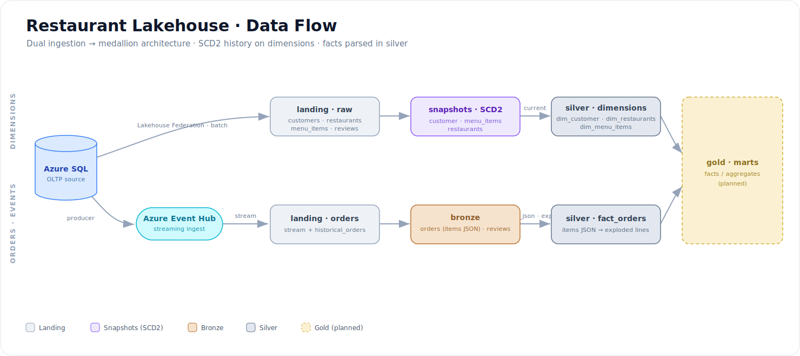
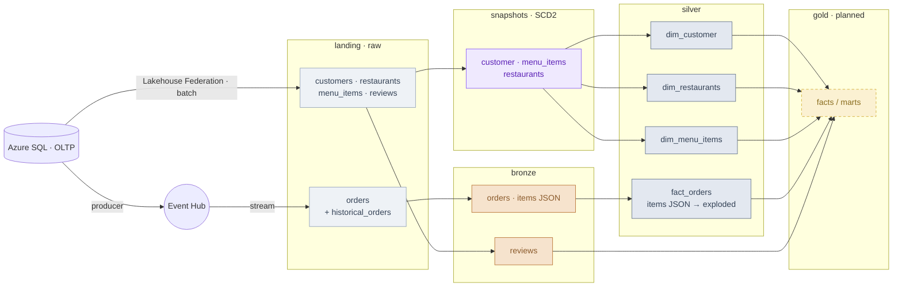

# Restaurant Data Platform — Databricks Lakehouse

An end-to-end lakehouse pipeline for a multi-restaurant ordering domain, built on **Databricks (Unity Catalog)** with **dbt**. It ingests from two source patterns that behave differently — a mutable OLTP database and an append-only event stream — and resolves them into a medallion architecture (landing → bronze → silver → gold) with SCD2 history on the dimensions.

The focus of the project is the engineering decisions, not the dataset: change capture on a mutable source, history preservation, the EL/ELT boundary, and keeping transformation logic out of the layers that have to stay raw.

---

## Architecture

Two ingestion lanes that behave differently, resolved into one medallion model:

- **Dimensions** (customers, restaurants, menu items) → `landing` → **SCD2 snapshot** → `silver` dim. Static, change-tracked, history-preserving.
- **Orders** → **Event Hub** stream → `landing` → `bronze` → `silver` **fact_orders** (the `items` JSON is parsed and exploded here). High-volume, event-shaped.

The two lanes converge in **silver** (conformed dims + fact), then feed **gold** marts.

**Dual ingestion by design.** Dimensions arrive as a batch pull over **Lakehouse Federation** — query-time access to Azure SQL, no copy step. Orders flow through **Azure Event Hub** via a Python producer and land as a stream. The two patterns are handled differently on purpose, because the data behaves differently.

---

## Tech stack

| Concern | Tool |
|---|---|
| Source | Azure SQL (OLTP) |
| Batch ingestion | Databricks Lakehouse Federation |
| Streaming ingestion | Azure Event Hub + Python producer |
| Storage / compute | Databricks, Unity Catalog (Delta) |
| Transformation | dbt (Core) |

---

## Pipeline layers

**`landing`** — Raw data as it arrives, no transformation. Federation-backed tables for the dimensions; the Event Hub sink for orders. This is the only layer with no logic, by rule (see Design decisions).

**`snapshots`** — SCD2 history captured directly off `landing`, before any cleaning. Snapshots exist for `customers`, `menu_items`, and `restaurants` — the mutable dimensions whose attributes drift over time. Orders are deliberately **not** snapshotted.

**`bronze`** — Lightly shaped, still close to raw. `orders` unions the one-time `historical_orders` load with the ongoing Event Hub stream into a single conformed feed; the `items` JSON payload is carried through untouched as a string. `reviews` is a typed pass-through.

**`silver`** — Cleansed and modeled. Current-state dimensions built from the SCD2 snapshots, filtered to the active version (`dim_customer`, `dim_restaurants`, `dim_menu_items`), plus **`fact_orders`** — the orders fact built from `bronze.orders`, where the raw `items` JSON string is parsed (`from_json`) and exploded into line-item grain. This is where the two ingestion lanes converge.

**`gold`** — Analytics-ready facts and marts. *(Planned — see Status.)*

---

## Design decisions

These are the choices that drive the architecture, with the reasoning behind each.

**Snapshots sit on logic-free landing, never on a cleaned model.** SCD2 history is captured straight from the `landing` sources, upstream of any transformation. If history were captured *after* cleaning, the cleaning logic would be frozen into every stored version — change the logic later and you can't reconstruct the old rows correctly. Snapshotting raw keeps history reproducible: transforms can be rewritten and re-run against the full version history at any time.

**Dimensions are snapshotted; the order stream is not.** Snapshots model *change over time* for entities whose attributes drift — a customer's address, a menu item's price. Orders are an append-only event stream; each order is an immutable fact, not a slowly-changing entity, so routing it through SCD2 machinery would add cost and complexity for no history benefit. This discrimination (mutable dimension → snapshot; transactional stream → don't) is deliberate.
---

## Status

Built and working:
- ✅ Dual ingestion — Azure SQL via Federation (batch) + Event Hub stream (orders), with a Python producer
- ✅ `landing` source definitions with `not_null` and `relationships` tests
- ✅ SCD2 snapshots for the three mutable dimensions (timestamp strategy, delete handling)
- ✅ `bronze` — orders (historical ∪ stream) and reviews
- ✅ `silver` — current-state dimension models off the snapshots

Planned:
- ⏳ `silver.fact_orders` — parse the `items` JSON array (`from_json` + `explode`) into line-item grain, joinable to the dims
- ⏳ `gold` — fact and mart models (revenue by category, order metrics, review analytics)
- ⏳ Broader silver cleansing and conforming on the dimensions
